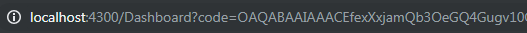
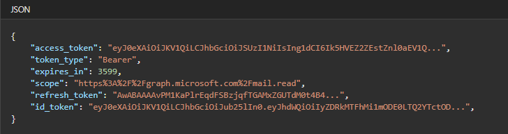

<a name="access_token"></a>

[back to Active Directory](../README.md/#ad)


# **Access Tokens**
Access tokens contain a user's id and permissions. This is what With [Microsoft Graph](./Microsoft-Graph.md/#microsoftusers) / [Graph API](./Graph-API.md/#graph) checks for authentication.


## Client Portal Token Service

###  1) TokenService - src/app/shared/services/token/

Variable
- refreshTokensTimer - Observable.timer(initial delay, interval);
    - timer to refresh tokens
    - Observable timer (0, number) starts immediately when it's called

Functions
- <code>getQueryVariable()</code>
    - gets the query string from the url (copy pasted from stack overflow)
- <code>getToken()</code>
    ```
    -> gets the code from the url
        -> graph call to get access token
            -> parse response body (IE only)
                -> save to local storage
    NOTE: localStorage is synchronous
    ```
- <code>inSession()</code>
    - used as a helper function of start session
    - returns a boolean depending on if there's an id_token in localStorage

- <code>startSession()</code>
    - if there is a logged in user/ a session, start the timer
    - code inside will get called each interval from the variable refreshTokensTimer

###  2) App Component - src/app/
- ngOnInit() calls <code>startSession()</code> from TokenService

### Decoding Tokens
- Try copy pasting an access_token/id_tokenin this website https://jwt.io/
- Grab values like these and validate them
    - Access Token
        - 'appid'(clientId)
        - 'tid' (tenantId)
        - 'exp' (expires in)

    - Id Token
        - 'aud' (clientId)
        - 'tid' (tenantId)
        - 'iss' (who issued the token)

### ETC
- Timing for localstorage tokens + graph calls
- Token Validation (jwt-decode)
    - also for timer
- Make a service in the backend to get and inject Graph API access token
- Invite user to the enterprise app the backend with Graph API access token

-----

### Important notes for Access Tokens for Client Portal

- In the Client Portal the access tokens can be found on LocalStorage
- Client Portal uses 3 tokens.

    1) Login Token
        - id_token
    2) Microsoft Graph Token
        - access_token
    3) Refresh Token
        - refresh_token

    To see your tokens:
    ```
    ⟶ Chrome Dev Tools
        ⟶ Application tab
            ⟶ Local Storage
    ```

----

## Howto get access tokens through the Authorization Code method

<a name="step1"></a>

### 1) Request authorization code
- Sign in the user and ensure consent for the permissions your app requests.
- This step returns an authorization code that you will use for step 2

Either Http GET request or copy and paste in the address bar:
```
    https://login.microsoftonline.com/{tenantId}/oauth2/v2.0/authorize?
    client_id={clientId}
    &response_type=code
    &redirect_uri={replyUrl}
    &response_mode=query
    &scope={scope}
```
How to get:

- tenantId
    ```
    ⟶ Active Directory
        ⟶ Properties
            ⟶ Directory ID is tenantId
    ```

- clientId
    ```
    ⟶ Active Directory
        ⟶ App registrations
            ⟶ Click on your app
                ⟶ Application ID is clientId
    ```

- replyUrl
    ```
    ⟶ follow steps for clientId
        ⟶ Settings
            ⟶ Reply URLS
                ⟶ any of the urls there is replyUrl
    ```

- scopes are your permissions. we use the two below
    - openid - permissions that are attached to the user
    - offline access - in order to receive a refresh token
    - Client Portal's value for scope is 'openid%20offline_access'

If successful, you will be redirected to your replyUrl with a code on the address bar. It will look like this:


### 2) Request access token
 - POST request to :
    ```
    https://login.microsoftonline.com/{tenantId}/oauth2/v2.0/token
    ```
Headers

| Key        | Value
| ------------- |:-------------:|
| Content-Type  | application/x-www-form-urlencoded|

Body

| Key        | Value
| ------------- |:-------------:|
| grant_type  | authorization_code|
| code  | {code}|
| clientId  | {clientId}|
| redirectUri  | {replyUrl}|
| client_secret  | {clientSecret}|

How to get:

- code - [Step 1](#step1)
- client_secret
    - client secrets are secret keys that tell azure you are logging in from the trusted client. This is for security. To make a client secret,
    ```
    ⟶ Active Directory
        ⟶ App Registrations
            ⟶ Click on your app
                ⟶ Settings
                    ⟶ Keys
    ```
    - Under Passwords, enter a key description and set the duration for your client_secret.
    - On save, a key value will be shown, be sure get the key before leaving the page as it will only display this once. This is your client_secret

If successful, you will receive a JSON object like this:


The access_token is what you will need for [Microsoft Graph](./Microsoft-Graph.md/#microsoftgraph) or [Graph API](./Graph-API.md/#graph) Queries

---

[back to Active Directory](../README.md/#ad)

