[back to Table of Contents](../README.md/#toc)

# <a name="orm"></a>Object-relational Mapping (ORM) Tools

ORMs let you let you **query and manipulate data** from a database using **Models** (Object Oriented)

General rule of thumb
- Models -> for changing data
- Migration -> for changing schema

Migration
- Include up and down functions that allow users to upgrade or rollback a schema update

## Comparison Table
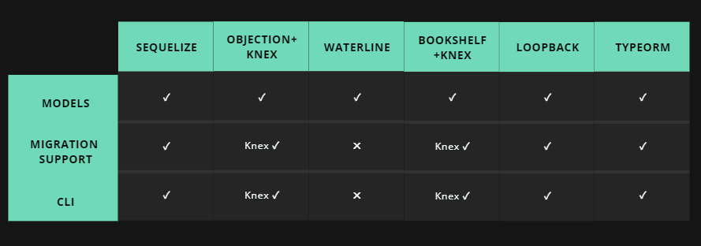

**Waterline is out!**

### Objection vs Bookshelf
- Both are built on top of knex which can handle migrations
- Bookshelf uses a Backbone-like Collection class to store a list of Models. This leads to the addition of unnecessary accessor methods and a weird API with Lodash methods.
- Bookshelf support is declining fast, people are moving towards Objection.

**Bookshelf is out**

### Loopback
Is an entire framework with an ORM rather than just an ORM. You can think of it as ORM + Express. Loopback handles models and migration. Really good if you are using multiple data sources and want to build relationships with them.


| Pros        | Cons           |
| ------------- |:-------------:|
| Old and has maintainers      | native SQL queries are experimental |
| Auto generation of migration scripts based on models.      | Doesn't let you filter on related properties, which is a huge omission - quite a bit of working around the framework to get what you need.     |
| Generates an API based on your models | Have to replace express that was already finished      |

For what we need, a whole backend overhaul is not needed.

**Loopback is out**

## **Top 3**
- Sequelize
- Objection + Knex
- TypeORM

## **Sequelize**

| Pros        | Cons           |
| ------------- |:-------------:|
| Old and large backing, still many active maintainers      | strict and normalized making specific complex queries hard to do. |
| Add-on library called sequelize-auto-migrations can generate migration scripts to upgrade      | No downgrade support yet for the auto-migration library     |
| Model and migration are both present | Need to configure for typescript by installing sequelize-typescript (this changes how you code sequelize as well)
| Able to use native SQL queries when needed |


Defining a model:

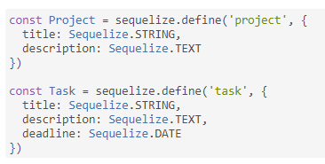

Using a model:

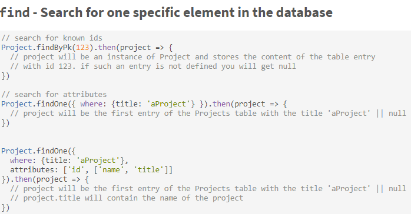

Model relationships:

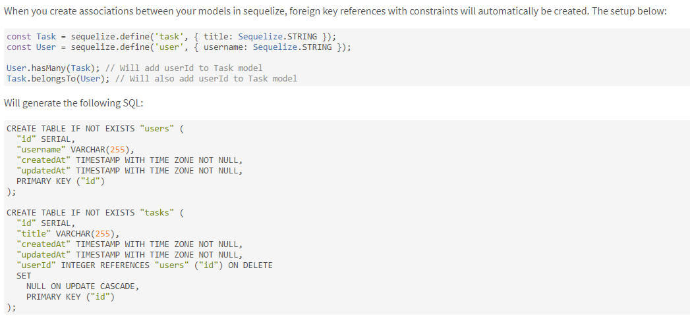

First time sync to DB:

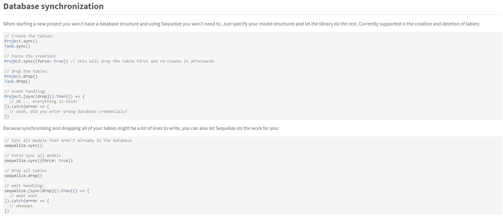

Auto generate migration scripts:

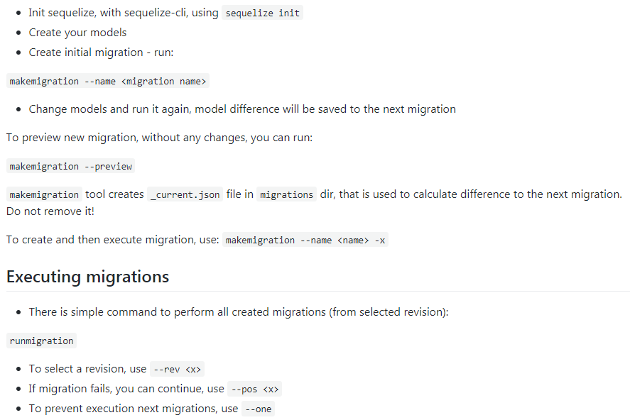

## **ObjectionJS + Knex**
- Simply provides a model and its relations
    - it isn't connected to knex by default so you'll need to connect them to enable migrations

- Loose modelling - you don't define the database schema. (this is handled by knex)
    - Optional JSON schema can be used for input validation that gets checked each time a model instance is created.

| Pros        | Cons           |
| ------------- |:-------------:|
| Intuitive and easy to setup     | Migration is separate (knex) |
| Getting more and more support      | Migration is manual (have to code up and down but files + structure are generated by knex) so schema related things are up to the user      |
| Excellent, up-to-date documentation
| Able to use knex in case you need to do native SQL entries
| All positive reviews online (literally all I've seen so far) ||
| Light weight and won't get in your way ||

Setting up knex:

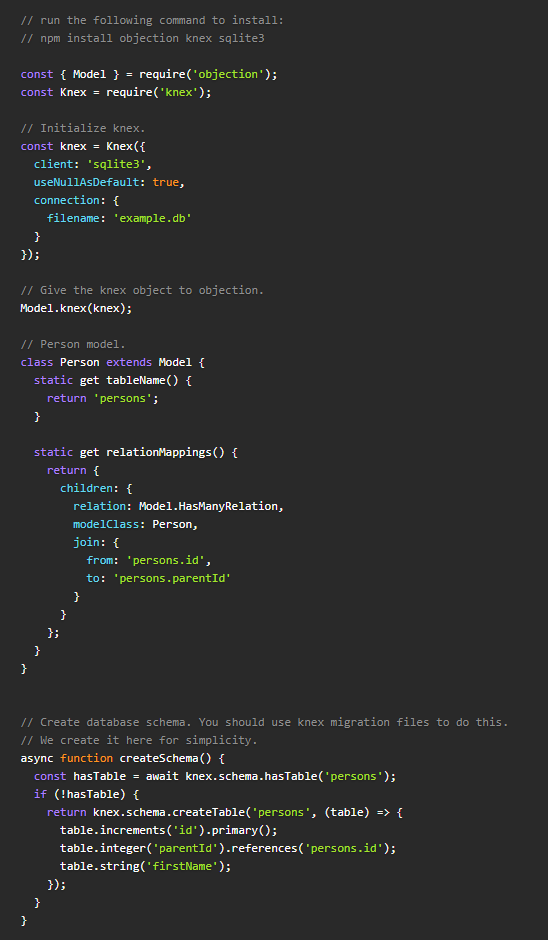


Defining a model:

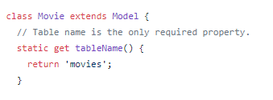

Model relationships:

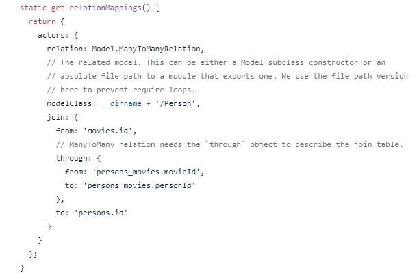

(Optional) Json schema:

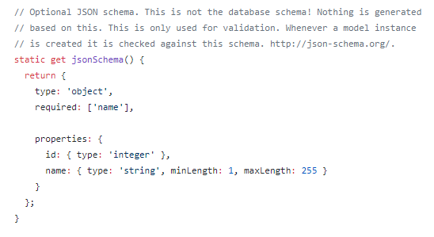

Example of Knex migration (manual):

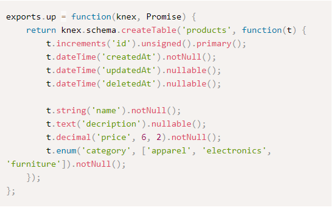

## **TypeORM**


You an also generate a model from the database by using the package

https://github.com/Kononnable/typeorm-model-generator

| Pros        | Cons           |
| ------------- |:-------------:|
| Old and large backing, still many active maintainers     | Relies on decorators ex @Column() instead of just @ Column (need to configure tsconfig options)  |
| Auto generation of migration scripts based on models using CLI     |       |
| Excellent, up-to-date documentation
| CLI setup makes it easy |
| Built for TypeScript (our API) ||
|  Able to use native SQL queries when needed  ||


Defining a model:

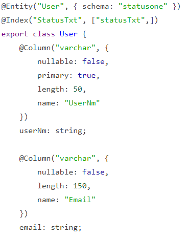

Using a model:


Auto migration:
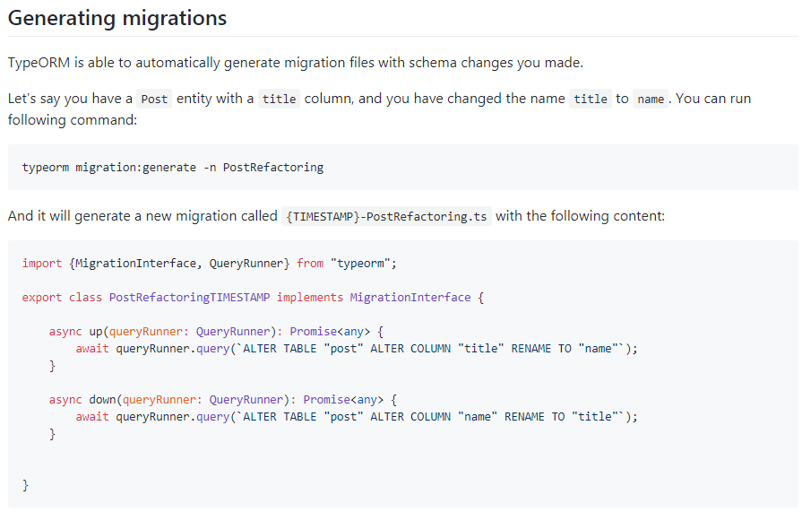

Manual migration:

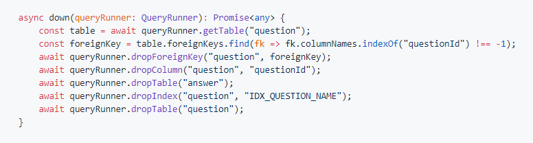

---

### Why **NOT** to use ORMs

- Slower performance
    - Native SQL is faster
    - Node's main benefit is its async execution flow. The serialization and deserialization caused by ORMs adds overhead
    - Complex calls can be inefficient

    ex.

[Source](https://medium.com/ameykpatil/why-orm-shouldnt-be-your-best-bet-fffb66314b1b)

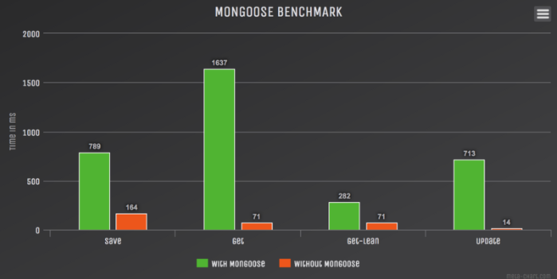
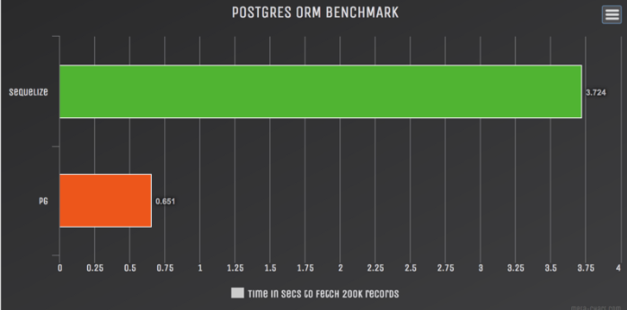

- Security
    - ORM tools mean that developers can insert, select, update, or delete whatever they want. Stored procedures provide more security. If data is really sensitive, don't use ORMs

---

### Personal opinion
- If manual migration functions are okay:
    - Objection JS + Knex
- Project wants to have tight code and database coupling,  auto generated migration scripts, and is:
    - Javascript -> Sequelize
    - Typescript -> TypeORM

- Would be nice to look into Prisma but it doesn't support MSSQL...yet!
    - Models follow GraphQL's schema definition language (SDL) which is super clean

    ```
    type User {
        id: ID! @unique
        email: String @unique
        name: String!
        posts: [Post!]!
    }

    type Post {
        id: ID! @unique
        title: String!
        published: Boolean! @default(value:"false)
        author: User
    }
    ```
    - Migration is easy

        1) Change schema

            ex.
            ```
            type Story @rename(oldName:"Post) {
                text: String
            }
            ```

        2) CLI enter the command:
            ```
            prisma deploy
            ```
        3) Remove @rename
        4) Done!


[back to Table of Contents](../README.md/#toc)
