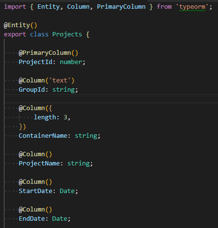
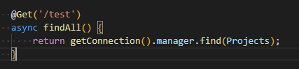
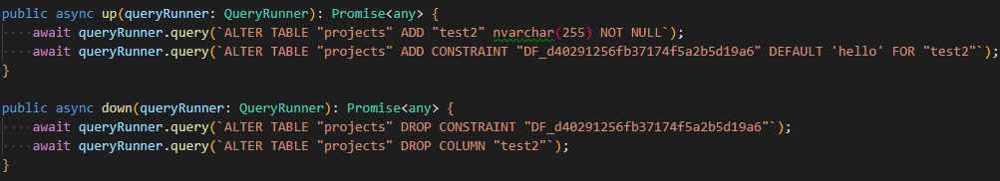
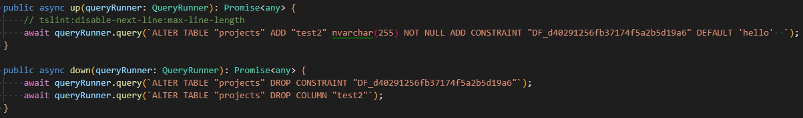

[back to Table of Contents](../README.md/#toc)

# <a name="to"></a>TypeORM

### Setup
- https://github.com/typeorm/typeorm/blob/master/README.md

### Two Core Elements
- Entity
- Migration

### Entity
- Acts as your model and your schema
    - Model
        - To make calls to change data
    - Schema
        - Migration will base the schema off of your entity

Looks like this:



- The object inside column is where you define options like:
    - constraints
    - default values
    - additional type parameters

### Part of the setup involves connecting typeorm to your database

To use your connection to the database:
- Use the getConnection() function
- Call the manager function
- Followed by what you really want to do. In this case, we want to retrieve all Projects by calling find()

ex.




---

### Migration
- Allows you to change your database schema while keeping existing data
- Allows upgrading and downgrading
- Compares your entity to your database

- Rule of thumb is to generate a new migration on each schema change.

To auto generate a script when you change your entity:
```
yarn typeorm migration:generate -n migrationName
```

- This will generate a script in your migration folder. The structure will look like this

```
-> src
    -> migration
        -> your scripts here
```
- Your scripts will be named with a timestamp + your migrationName.

_You can edit the migration script with SQL or a query runner._

To run your migration script
```
yarn typeorm migration:run
```

Your database will have a new table called migrations. This is what TypeORM checks for to know if a migration has been run and which migration came first.

---

### Important notes

### 1) Wrong script generated when adding columns for Microsoft SQL
- When adding a new column in your entity, if you don't specify the {nullable:true} or want to create one that's not null.
- You can add an option in the @Column field to set a default value ex.  {default : 'hello'}

This is the script that will be generated:



This will cause an error because it won't allow you to create a not null column without a default value. However, the default value is on the second query so it fails.

To get around this:
- **move the add constraint to the first query.**


### 2) Changing a constraint in a column, even a small one like length, will generate a script that will drop the column and create a new one. This results in data loss
- Manually write the migration after generating it


[back to Table of Contents](../README.md/#toc)


