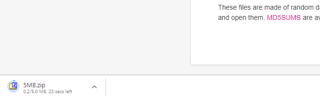
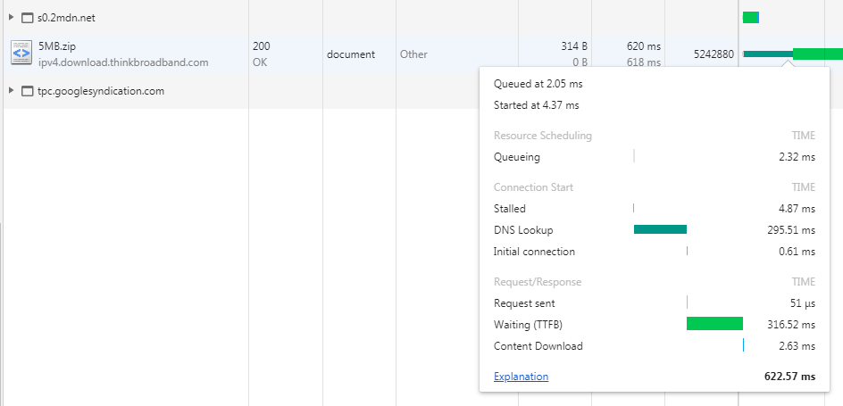
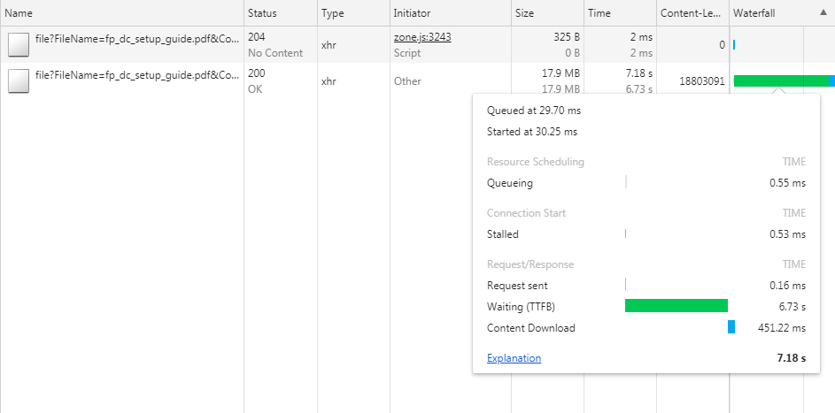
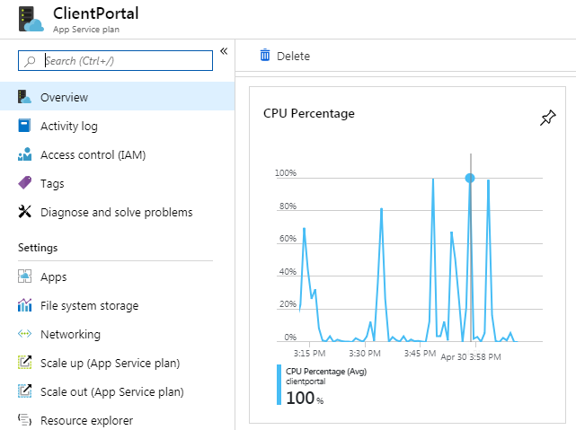
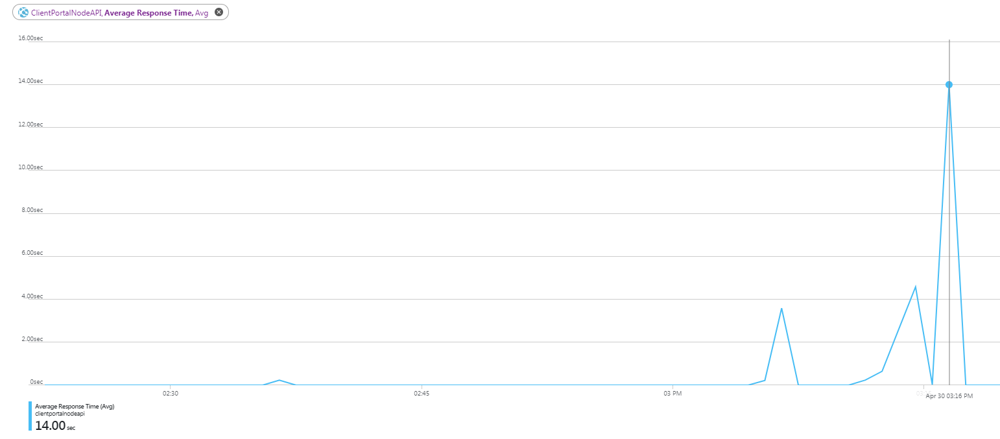

# Portal's upload and download speed problem (slow)

## Problems
- When two to three users are downloading or uploading, CPU on Azure spikes to 100%.
- Downloading a 5mb file takes around 10 seconds

## Things to know before
- TTFB (Time till first byte)
    - Measurement of how long the browser has to wait before receiving its first byte of data from the server.
    - is important to a webpage since it indicates pages that load slowly due to server-side calculations that might be better served as client-side scripting

## Context
**In most sites**


- There's an indicator of what you're downloading.

Network request


- TTFB is only at 316ms for a 5MB file.
- Note that the 5mb file size is only 314B on the network tools.

**For us**
- The entire burden is currently on the API. This is where we download the entire stream before sending it to the front end as one object.
    - This causes the user to have no response when clicking download until the API sends the entire object back and the browser instantly receives it as a complete file.

Network request


- Our TTFB is high and we don't get a download indicator. This may be a flaw in how the file download system is set up.
- A Second Problem is that although the size is simply 5mb, the response size is 17.9 MB. Compare this to the 314B file above. The zip doesn't matter as the whole zip file itself is 5MB. Also, on mainstream sites, it's considerably smaller than the actual file size.

------

## Here are some findings after logging time data

The average response time of the client is around 3 seconds for downloading/uploading tasks.

When testing production client portal, I used 3 windows that simultaneously upload and download several 5mb files. Checking Azure's monitoring tools,


Drilling down to the API statistics, The average response time varies between 4 seconds to 14 seconds. The spikes happened when 3 users were downloading.


Going into the code, the function that takes the biggest chunk of time (around 50% of the time) is in the azure.BlobService functions -  including the one that downloads the blob to the API.

With the combination of CPU maxing out and the storage functions being slow, our download time is abysmal.

## Possible solutions

To accommodate more users:
 ### Upgrade from S1 to S2 App-Service plan
 - Seeing that CPU hits the maximum of 100% whenever an action of downloading or uploading is done with a few users show that we could need more capacity. Buffing this up is the quickest way to accommodate more users.
- In my opinion, this is the best band-aid solution for an instant fix but the worst long term solution as the foundation is inefficient and unscalable. Adding a static increase in performance will only solve the short term problem.

To download files faster:
### Compress our files when uploading
- Since a big chunk of time is communicating with azure, compressing the file when uploading can put some burden on our CPU but we can decrease the need to talk to azure as much by sending less data.
- Possible compression errors is something to consider
- Uploading MIGHT take a bit longer due to compression. This depends on how fast the compressed file gets uploaded to Azure

### Azure CDN to download files faster
- To download files faster, we can attach Azure's CDN to our blobStorage
- Downside is that our files will be stored somewhere else (possibly on the West US side since that is the closest one to us)

### Revamp the file download system (we will transfer the burden to the client rather than our API)
- Make our downloading system similar to that of others. This means that their PCs will be the one taking the load instead of our API.
- We can find and fix the problem where the response size is 3x the file size when downloading (downloading less data will make it faster)
- Transferring burden will lower our CPU% meaning we can have more users
- I believe this is the best long term solution but it will require some time.

## Conclusion (mine at least)
**Fix the file download system + compress our files**
1) Limit our communication with Azure by sending less so that we have more control (we can't change Azure things but we can change ours)
2) Reduces stress on our App Service to be able to bring in more users
3) Make response size very small like that of others (this may increase download speed).


## UPDATE
- Since we want to secure the blob storage, we need to have the infrastructure setup this way:
```
 storage -> api -> client
 ```
 therefore streaming the data twice is a must.

 - Compression is an option
 - CDN is still on the table (have to ask client)
 - Looking at the file service functions can be a possible option but since we are using azure-storage (recommended library) it will be unlikely to find things to change
 - Upgrading our app-service plan from S1 to S2 will happen (temp fix)

 TODO
 - Find if 'size' in network tab is high because it simply records the log from storage -> api -> client and we are simply getting a 5MB file still or if it really sends us duplicates.


